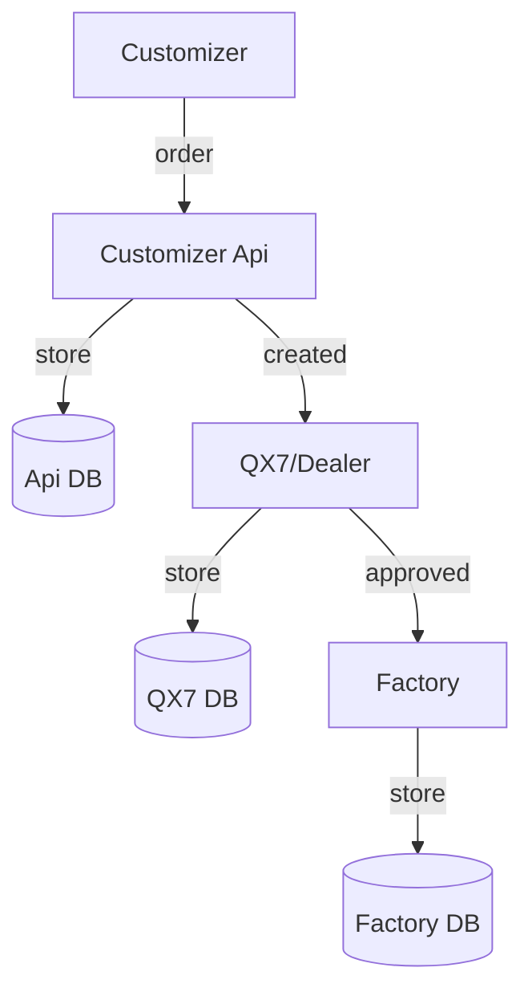
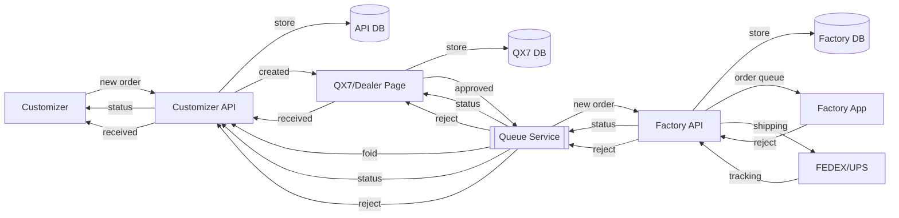
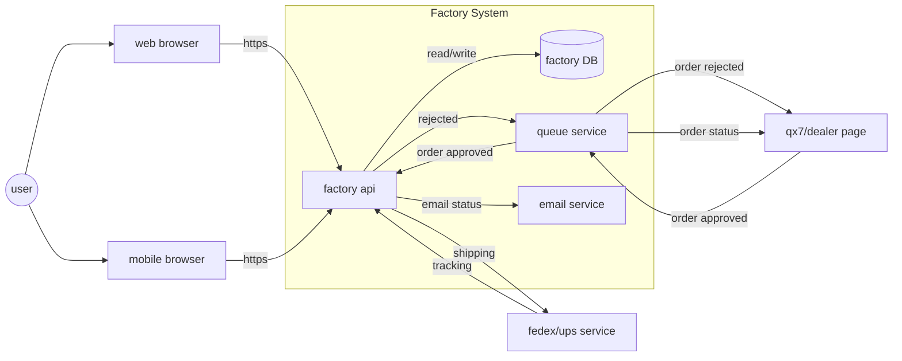
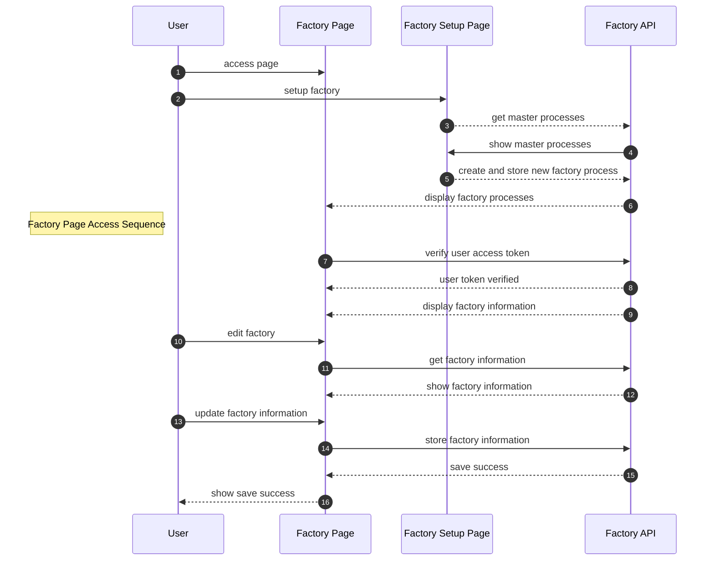

### Software Design Documentation

### Factory 2.0
Date: Feb 14, 2022

#### Introduction
**Purpose**
This software design document describes the structure of the software and how it will be built and executed. The file provides technical details and a description of all methods and technologies.  

**Scope**
The software design document’s scope sets the requirements for the software, helping the team and the stakeholders summarize the characteristics of the desired product. Here, parties state which features are essential to achieve business objectives and user experience goals. In particular, the document is focused on describing the essential functionality and critical architectural components. 

**Audience**
This document will be created and used by the development team, project manager, and the client. The process of making changes to the software design document should be discussed with all participants. All stakeholders are free to refer to SDD at any stage of the project. 

#### System Overview

#### Design Considerations
**Automation**
**Backward Compatibility**
**Mobile Optimized**
**Performance**
#### System Architecture and Architecture Design
- System Architecture Diagram

    
- Software Architecture Diagram

- Sequence Diagram   

---

#### Design Specifications
- Business Requirements
- Database Design
- User Interface Design
